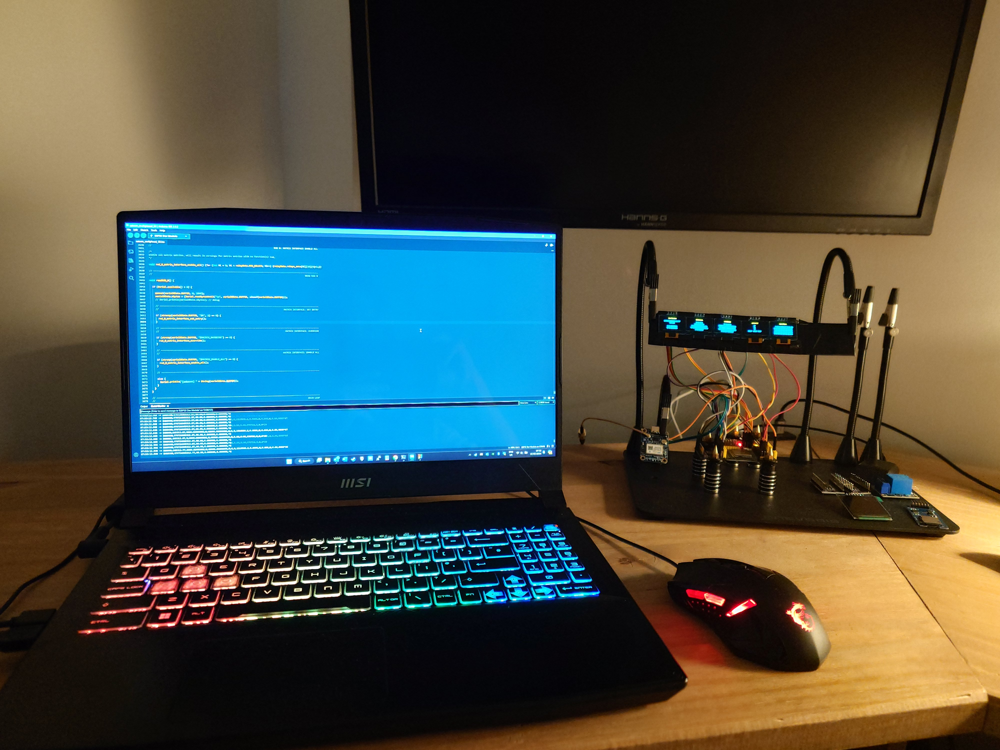
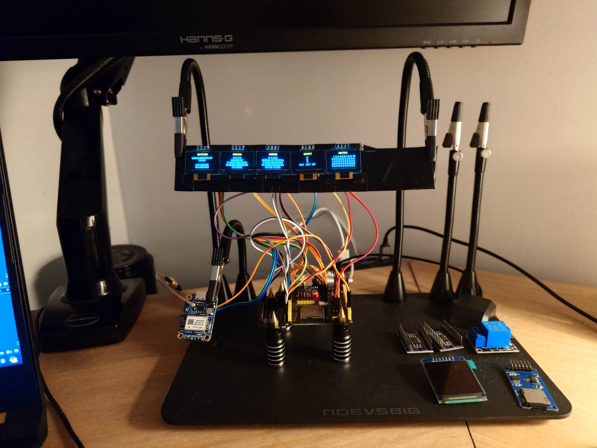

---

                                           SATCOM - Written by Benjamin Jack Cullen.

                                  A general purpose programmable satellite and inertial switch. 

                Receives and Processes Transmissions from Satellites and makes the data available for calculations.

                Possible combinations example: 100 checks ^ 10 functions = 100,000,000,000,000,000,000 combinations.
                                                                           100 Quintillion.
            Currently there are over 200 different checks that can be performed using just several small primitive functions and
             currently each relays activation/deactivaion can occur based on up to 10 different checks resulting true or false. 
                                      
                          Wiring (Keyestudio ESP32 Dev Board):
                          WTGPS300P TX               --> ESP32 io26 as RXD (5v)
                          TCA9548A i2C Multiplexer   --> ESP32 i2C (3.3v. ensure 3.3 not 5v or you will have periodic panel chaos)
                          x6 SSD1306 (blue & yellow) --> TCA9548A i2C Multiplexer (wrired from sda/sdc 7 down)
                          SDCARD Adapter HW-125      --> CS 05, SCK 18, MOSI 23, MISO 19, VCC 5v (Optional)
                          D-PAD                      --> right 34, left 33, up 32, down 39, select 36

                                                      SENTENCE $SATCOM
                                                                                    
                      START Tag                Last Sat Time                    Converted Longitude        
                         |                   |               |                   |               |                  
                      $SATCOM,000000000000.00,000000000000.00,00.00000000000000,00.00000000000000,*Z
                             |               |               |                 |                              
                               DatetimeStamp                  Converted Latitude                                 

                        Ultimately this system is being built as a unit to turn on/off multiplexed relays (40+)
                     where potentially anything can be plugged in such as simple modules or pre-programmed MCU's, 
               making a foundation for other creative projects that may make use of such satellite and or inertial data.
               The idea is that each relay is controlled by a compound of logic (limited by memory), and the logic itself
               is programmable before and after flashing. Allowing for a reusable and general purpose system for any future
               projects requiring such data. more advanced calculations are intended, such as emphemeris, astronomical etc. now
               that the foundational data has been handled.

               The relays are currently simulated while the system is being built and the simulation is designed to be easily
               relaceable by the actual relays themselves once the logic has been completed to a satisfactory degree and currently
               all logic required to activate and deactivate relays is in place. 

---

---

---

Pending documentation as SATCOM will require a handbook.
